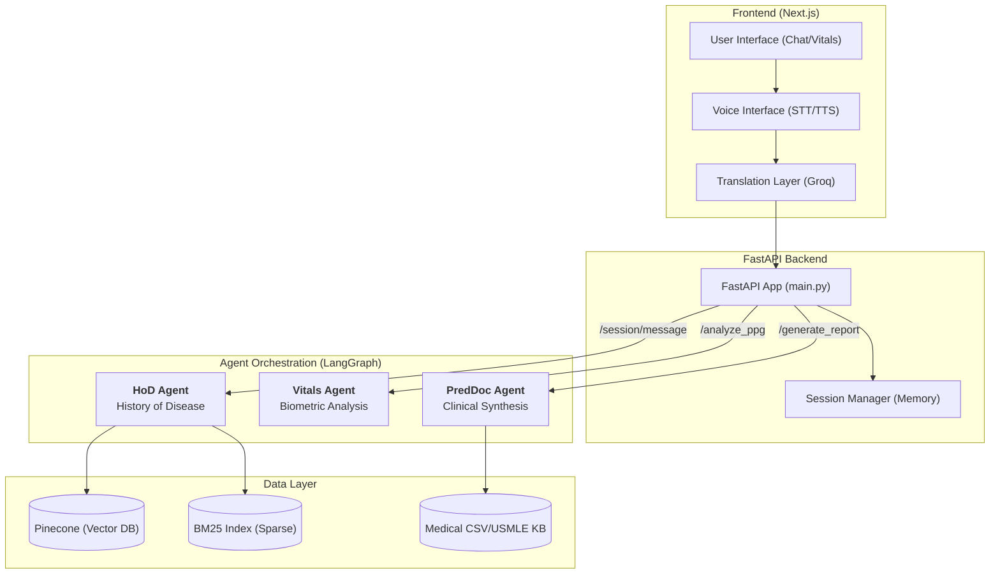
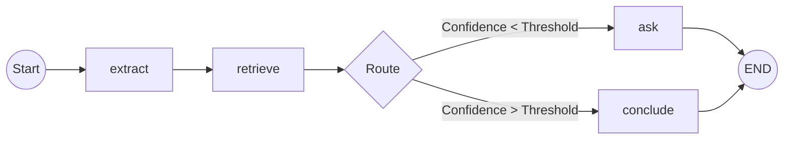
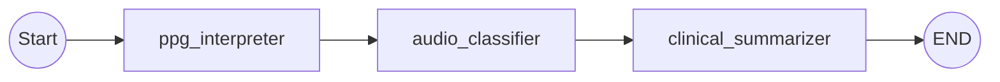
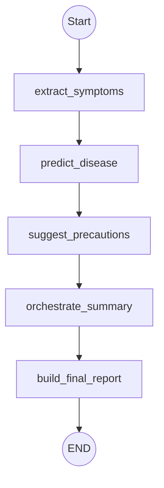

# Startup Guide

## Prerequisites

* Python 3.10+
* Node.js 18+
* `uv` installed (`pip install uv`)

---

## Backend (FastAPI)

```bash
# create virtual environment 
uv venv 
# activate it 
source .venv/bin/activate # Windows: .venv\Scripts\activate

# sync dependencies from pyproject.toml
uv sync

# start server
uvicorn main:app --reload
```

Runs on: http://localhost:8000
Docs: http://localhost:8000/docs

---

## Frontend (Next.js)

```bash
cd frontend
npm install
npm run dev
```

Runs on: http://localhost:3000

---

## Environment setup

```
cp backend/.env.example backend/.env 
cp frontend/.env.example frontend/.env.local
```
---
# Technical Flow & Agent Architecture

This document provides a detailed breakdown of the 1stDoctor technical architecture, from the FastAPI entry points to the granular nodes within each LangGraph agent.

## 1. System Architecture Overview

The following diagram illustrates the flow of data from the user interface through the FastAPI backend and into the multi-agent orchestration layer.



---

## 2. Granular Agent Node Flows

Each agent is a specialized LangGraph pipeline with its own internal state and decision logic.

### A. HoD Agent (Conversational Intake)
*Goal: Dynamically gather symptoms and build a clinical history.*



### B. Vitals Agent (Biometric Scanning)
*Goal: Transform raw camera/mic signals into clinical metrics.*



### C. PredDoc Agent (Final Diagnosis & Reporting)
*Goal: Synthesize all data into a professional medical report.*



---

## 4. Endpoint to Agent Mapping

| Endpoint | Primary Agent | Purpose |
| :--- | :--- | :--- |
| `POST /session/message` | **HoD Agent** | Processes chat turns, extracts symptoms, and asks clarifying questions. |
| `POST /analyze_ppg` | **Vitals Agent** | Analyzes PPG pulse signals and respiratory audio for biometric health. |
| `POST /assess` | **PredDoc Agent** | Runs a full assessment on raw text input (standalone mode). |
| `POST /generate_report` | **PredDoc Agent** | Finalizes the session, merges all data, and triggers PDF generation. |
| `GET /download_report` | **PDF Agent** | Serves the generated PDF file to the user. |
